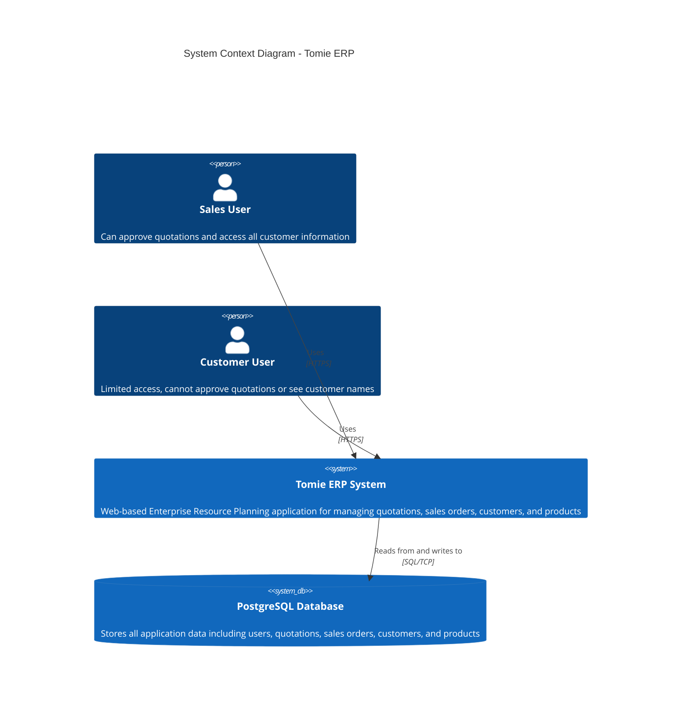
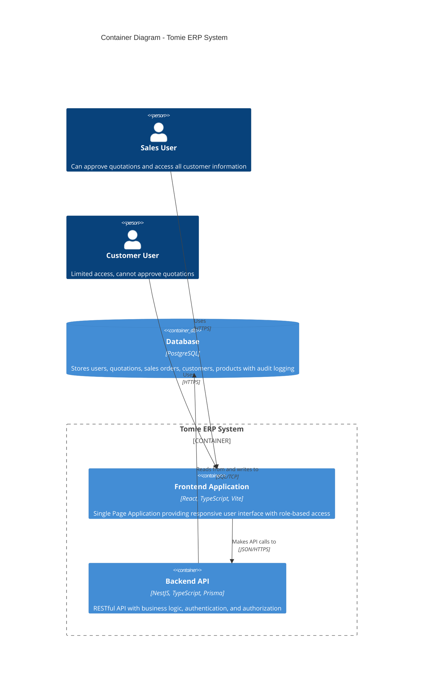
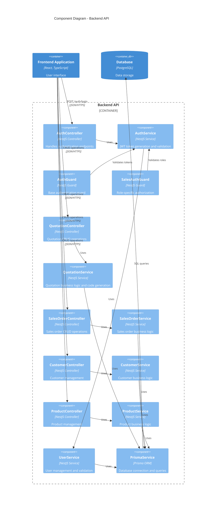
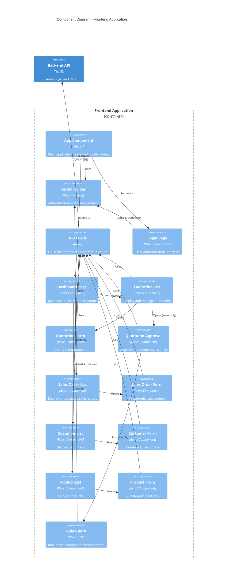
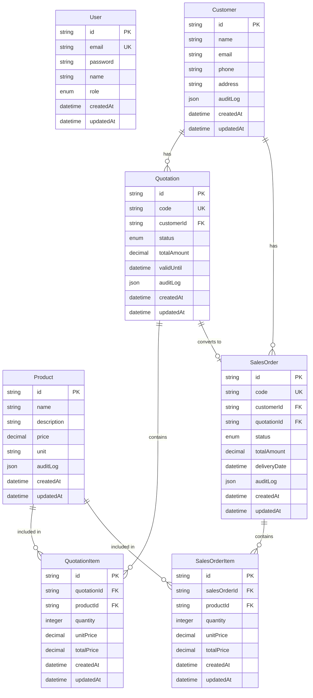
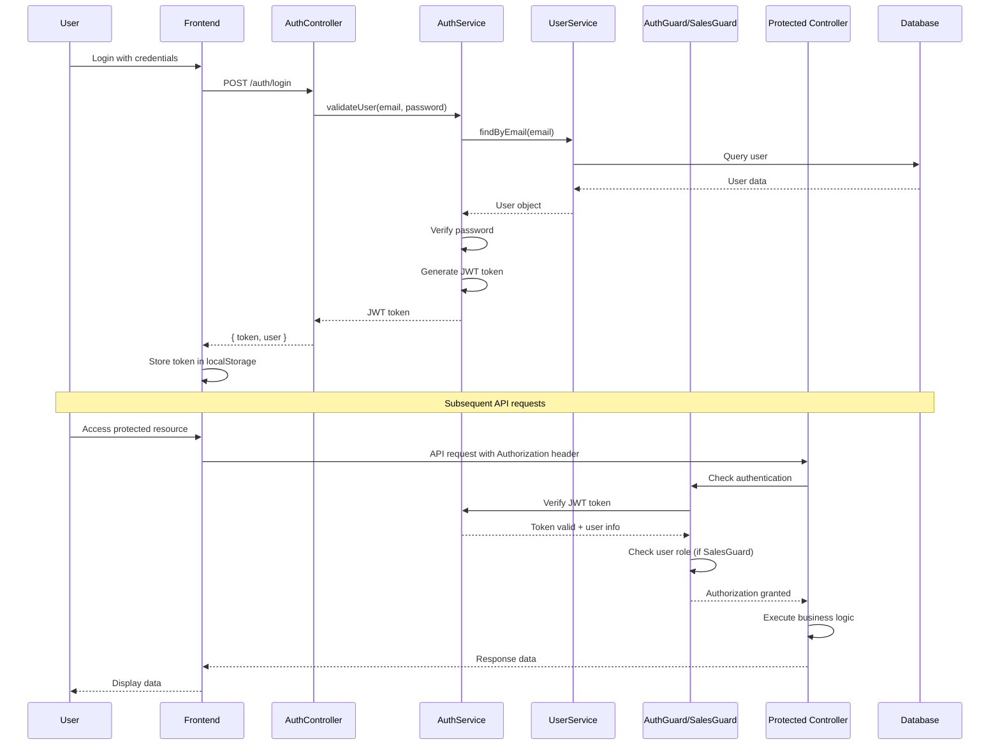
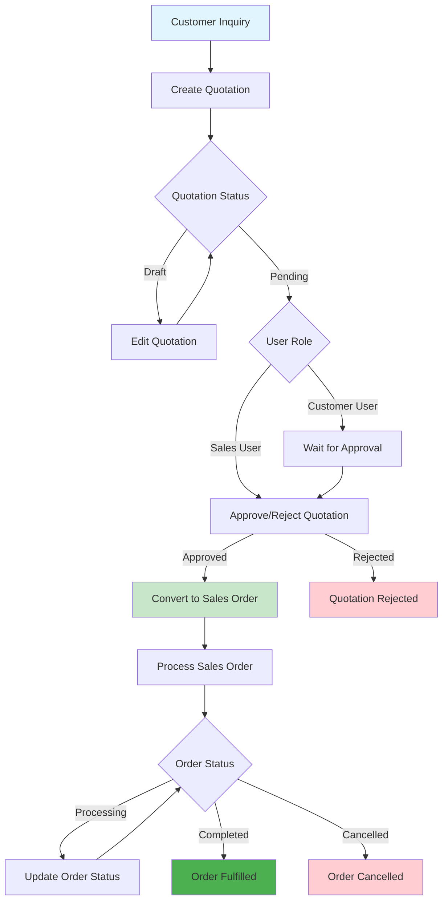
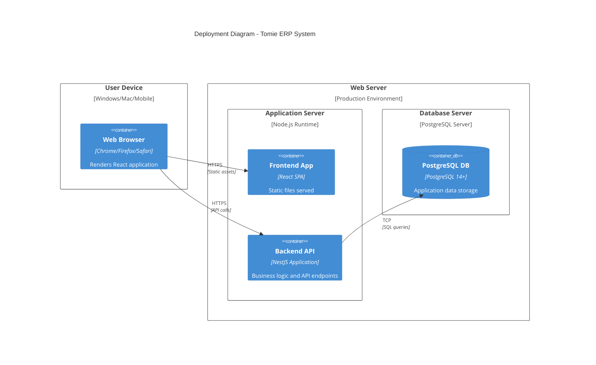

# Tomie ERP System Diagrams

This document contains visual representations of the Tomie ERP system architecture using Mermaid diagrams following the C4 model approach.

## 1. System Context Diagram (C4 Level 1)

This diagram shows the high-level system boundaries and external actors interacting with the Tomie ERP system.

## 2. Container Diagram (C4 Level 2)

This diagram illustrates the main containers (Frontend, Backend API, Database) and their relationships.

## 3. Backend Component Diagram (C4 Level 3)

This diagram details the internal structure of the NestJS backend API.

## 4. Frontend Component Diagram (C4 Level 3)

This diagram shows the structure of the React frontend application.

## 5. Database Schema Diagram

This diagram illustrates the database structure and relationships.

## 6. Authentication & Authorization Flow

This diagram shows the authentication and authorization flow in the system.

## 7. Business Process Flow

This diagram illustrates the main business processes in the ERP system.

## 8. Deployment Architecture

This diagram shows the deployment architecture and infrastructure components.

## Key Features Highlighted in Diagrams

### Role-Based Access Control

- **Sales Users**: Can approve quotations, see customer names, access all functionality
- **Customer Users**: Limited access, cannot approve quotations or see sensitive customer data

### Audit Logging

- JSON columns in database tables track changes and history
- Implemented for Customer, Product, Quotation, and SalesOrder entities

### Responsive Design

- Frontend built with mobile-first approach
- Components designed for various screen sizes

### Code Generation

- Automatic generation of quotation and sales order codes
- Ensures unique identification for business documents

### Data Relationships

- Clear entity relationships with proper foreign key constraints
- Support for converting quotations to sales orders
- Item-level tracking for both quotations and sales orders
